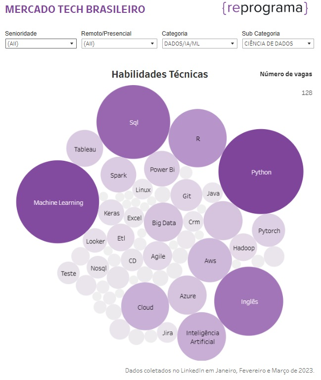
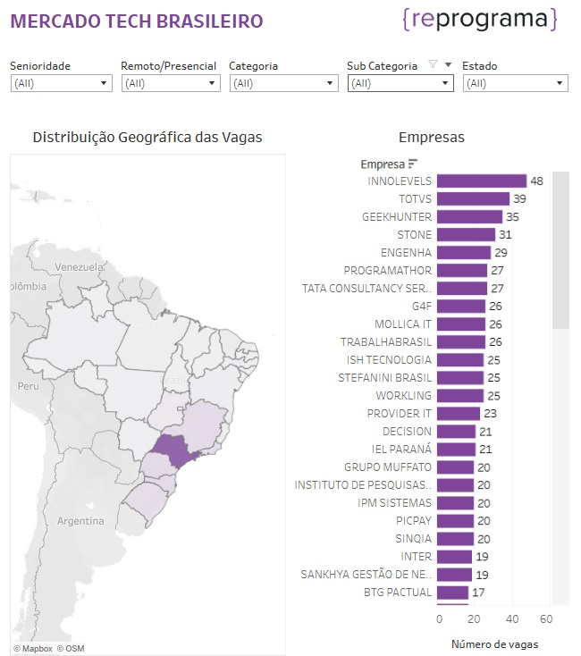

# Análise de Oferta vs. Demanda de Profissionais de Tecnologia no Brasil

## Visão Geral  
Este projeto teve como objetivo analisar a oferta e demanda por profissionais de tecnologia no Brasil a partir das vagas publicadas no LinkedIn e respectivas candidaturas. A análise considerou aspectos como localização, nível de senioridade, habilidades técnicas mais demandadas, formato de trabalho (presencial, híbrido ou remoto) e categorias profissionais.

Os resultados desta análise foram utilizados para embasar decisões estratégicas da **{reprograma}**, especialmente na definição do portfólio de cursos oferecidos. O foco foi identificar cargos com alta demanda e baixa oferta de profissionais, bem como mapear as habilidades técnicas mais requisitadas para cada posição.

Além da análise de vagas, este estudo fez parte de uma investigação de mercado mais ampla, que incluiu:

- Comparação do portfólio de cursos de organizações similares.  
- Análise de relatórios de tendências do mercado de tecnologia no Brasil e no mundo.  
- Trocas com líderes do setor, incluindo representantes da **FIAP, GetOnBoard, Lumini e GOYN Colômbia**, que contribuíram para o planejamento e desenvolvimento da pesquisa.  

---

## Estrutura do Projeto  
O projeto contemplou as seguintes etapas:

### 1. Entendimento do Negócio  
- Definição do problema e motivação do estudo.  
- Contextualização sobre o mercado de trabalho em tecnologia no Brasil.

### 2. Coleta de Dados  
A coleta de dados foi realizada entre **janeiro e março de 2024**, utilizando **Octoparse** para extrair informações de vagas de emprego na área de tecnologia publicadas no LinkedIn.  

### 3. Preparação dos Dados  
Os dados extraídos foram processados e tratados utilizando **Python** no ambiente **Jupyter Notebook**, com o suporte das bibliotecas **pandas** e **numpy** para limpeza e organização das informações.  

- A classificação de **senioridade, modelo de trabalho e habilidades técnicas** foi feita a partir da descrição da vaga, com base em palavras-chave pré-definidas.  
- Vagas classificadas na categoria **"Outros"** não apresentavam nenhuma das palavras-chave utilizadas para agrupamento.  
- As vagas foram **categorizadas e subcategorizadas** com base em termos encontrados nos títulos dos anúncios.  
- O número de candidaturas consideradas variou entre **25 e 200 por vaga**.  

### 4. Análise Exploratória  
- Visualização de dados utilizando **Plotly e Tableau**.  
- Análise da distribuição de vagas por categoria, senioridade e tipo de trabalho (remoto, híbrido ou presencial).  

### 5. Visualização e Insights  
- Identificação de áreas com maior e menor demanda.  
- Comparação entre número de vagas abertas e quantidade de candidatos aplicando para cada tipo de cargo.  
- Mapeamento das principais ferramentas exigidas para cada posição.
- Distribuição geográfica das vagas

---

## Tecnologias Utilizadas  
- **Web Scraping:** Octoparse  
- **Manipulação de Dados:** Python (Jupyter Notebook, Pandas, NumPy, Plotly)  
- **Visualização de Dados:** Tableau  

---

## Resultados Principais  
- Identificação de **desbalanceamento entre oferta e demanda** para diferentes perfis profissionais.  
- Mapeamento das **tecnologias mais requisitadas** para cada tipo de vaga.  
- Comparação entre **modelos de trabalho** (remoto, híbrido, presencial). 
- Distribuição **geográfica** das vagas
- Insights estratégicos para otimizar o **portfólio de cursos** na **{reprograma}**.  

---

## Próximos Passos 
- Agregar informações mais atualizadas de vagas. 
- Desenvolver modelos preditivos para antecipar tendências no mercado de tecnologia.  

---

## Observações
O arquivo de vagas disponibilizado neste repositório não contém toda a base original analisada devido à limitação de tamanho de arquivo permitido no github. Caso queira explorar a base completa, favor entrar em contato.

---
## Visualizações no Tableau

  
*Figura 1: Exemplo de principais ferramentas demandadas para profissionais de ciência de dados considerando todos os níveis de senioridade.*  

  
*Figura 1: Análise dos Estados com maior demanda de profissionais de tecnologia e empresas com maiores números de vagas no período.*  

## Visualizações no Jupyter

Contribuições e sugestões são sempre bem-vindas! 😊