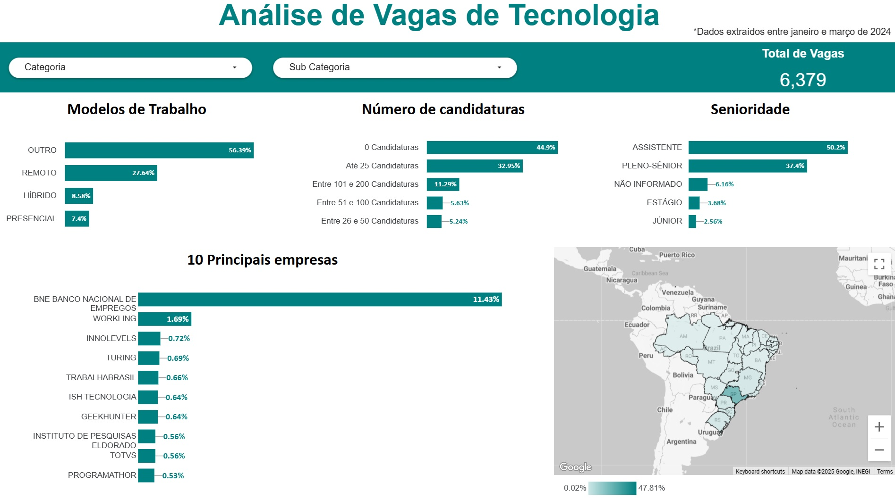
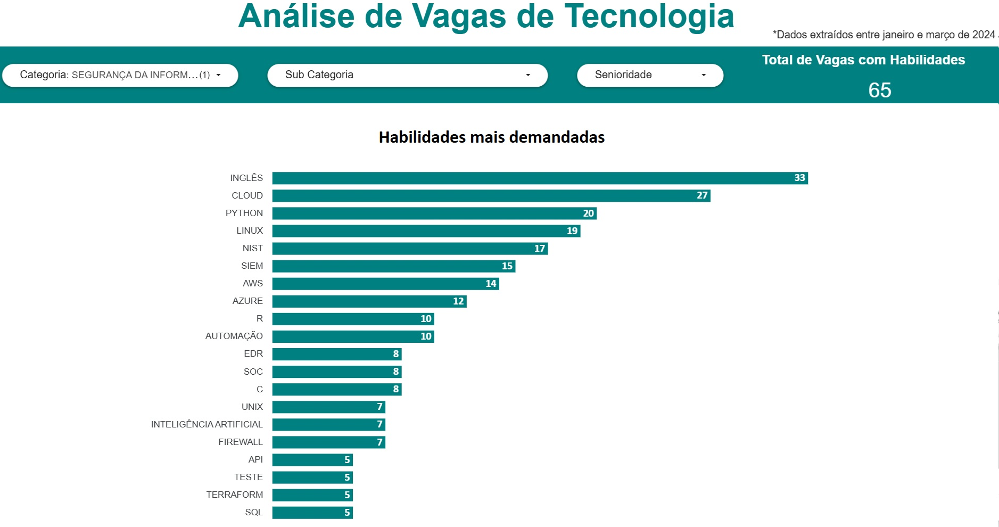

# Análise de Oferta vs. Demanda de Profissionais de Tecnologia no Brasil

## Visão Geral  
Este projeto teve como objetivo analisar a oferta e demanda por profissionais de tecnologia no Brasil a partir das vagas publicadas no LinkedIn e respectivas candidaturas. A análise considerou aspectos como localização, nível de senioridade, habilidades técnicas mais demandadas, formato de trabalho (presencial, híbrido ou remoto) e categorias profissionais.

Os resultados desta análise foram utilizados para embasar decisões estratégicas da **{reprograma}**, especialmente na definição do portfólio de cursos oferecidos. O foco foi identificar cargos com alta demanda e baixa oferta de profissionais, bem como mapear as habilidades técnicas mais requisitadas para cada posição.

Além da análise de vagas, este estudo fez parte de uma investigação de mercado mais ampla, que incluiu:

- Comparação do portfólio de cursos de organizações similares.  
- Criação de um banco de relatórios externos sobre tendências do mercado de tecnologia no Brasil e no mundo e análise dos mesmos.  
- Trocas com líderes do setor, incluindo representantes da **FIAP, GetOnBoard, Lumini e GOYN Colômbia**, que contribuíram para o planejamento e desenvolvimento da pesquisa.  

---

## Estrutura do Projeto  
O projeto contemplou as seguintes etapas:

### 1. Entendimento do Negócio  
- Contextualização sobre o mercado de trabalho de tecnologia no Brasil para construção de estratégias de desenvolvimento de profissionais demandados.

### 2. Coleta de Dados  
A coleta de dados foi realizada entre **janeiro e março de 2024**, utilizando **Octoparse** para extrair informações de vagas de emprego na área de tecnologia publicadas no LinkedIn.  

### 3. Preparação dos Dados  
Os dados extraídos foram processados e tratados utilizando **Python** no ambiente **Jupyter Notebook**, com o suporte das bibliotecas **pandas** e **numpy** para limpeza e organização das informações.  

- A classificação de **senioridade, modelo de trabalho e habilidades técnicas** foi feita a partir da descrição da vaga, com base em palavras-chave pré-definidas.  
- Vagas classificadas na categoria **"Outros"** não apresentavam nenhuma das palavras-chave utilizadas para agrupamento.  
- As vagas foram **categorizadas e subcategorizadas** com base em termos encontrados nos títulos dos anúncios.  
- O número de candidaturas consideradas variou entre **25 e 200 por vaga**.  

### 4. Análise Exploratória  
- Visualização de dados utilizando **Plotly e Tableau**.  
- Análise da distribuição de vagas por categoria, senioridade e tipo de trabalho (remoto, híbrido ou presencial).  

### 5. Visualização e Insights  
- Identificação de áreas com maior e menor demanda.  
- Comparação entre número de vagas abertas e quantidade de candidatos aplicando para cada tipo de cargo.  
- Mapeamento das principais ferramentas exigidas para cada posição.
- Distribuição geográfica das vagas

---

## Tecnologias Utilizadas  
- **Web Scraping:** Octoparse  
- **Manipulação de Dados:** Python (Jupyter Notebook, Pandas, NumPy)  
- **Visualização de Dados:** Looker e Plotly

---

## Resultados Principais  
- Identificação de **desbalanceamento entre oferta e demanda** para diferentes perfis profissionais.  
- Mapeamento das **tecnologias mais requisitadas** para cada tipo de vaga.  
- Comparação entre **modelos de trabalho** (remoto, híbrido, presencial). 
- Distribuição **geográfica** das vagas
- Insights estratégicos para otimizar o **portfólio de cursos** na **{reprograma}**.  

---

## Próximos Passos 
- Agregar informações mais atualizadas de vagas. 
- Desenvolver modelos preditivos para antecipar tendências no mercado de tecnologia. 

---

## Observações
O arquivo de vagas disponibilizado neste repositório não contém toda a base original analisada devido à limitação de tamanho de arquivo permitido no github. Caso queira explorar a base completa, favor entrar em contato.

---
## Visualizações no Looker

Entre em contato para acessar o dashboard completo.

  
*Figura 1: Distribuição de vagas por categorias e subcategorias.*  

  
*Figura 2: Análises relacionadas a modelo de trabalho, número de candidaturas, senioridade, empresas e localização.*  

  
*Figura 1: Exemplo de principais ferramentas demandadas para profissionais de tecnologia.*   

## Visualizações no Jupyter
Ao rodar o notebook com o csv origingal (entre em contato para acesso), é possível visualizar:
- Distribuição de vagas por categoria
- Distribuição de vagas por senioridade
- Distribuição de vagas por modelo de trabalho
- Distribuição de vagas por categoria e senioridade
- Distribuição de vagas por senioridade e categoria
- Distribuição de candidaturas por vaga por categoria e senioridade
- 10 habilidade mais demandadas no geral
- 5 habilidades mais demandadas por categoria
- Sankey de distribuição de senioridade por categoria
- Mapas coropléticos de distribuição de vagas e de candidaturas por vaga por Estado.

## Conclusões e análises descritivas:

- **Categorias consideradas na análise:**  
- Desenvolvimento
  - ANÁLISE DE SISTEMAS
  - DADOS/BI
  - DESIGN/UX/UI
  - ANÁLISE DE NEGÓCIOS
  - LIDERANÇA
  - CLOUD/DEVOPS/INFRA
  - SEGURANÇA DA INFORMAÇÃO
  - QUALIDADE/TESTES

- **Níveis de senioridade considerados na análise:**
  - ESTÁGIO
  - JÚNIOR
  - PELNO-SÊNIOR
  - NÃO INFORMADO

- **Análise de vagas e candidaturas por categorias:**
  - A categoria com maior número de vagas disponíveis foi DESENVOLVIMENTO, representando mais de 45% do total de 6379 vagas analisadas. 
  - As categorias DESENVOLVIMENTO, ANÁLISE DE SISTEMAS, DADOS/BI, DESIGN/UX/UI, juntas representam aproximadamente 90% do total de vagas.
  - A categoria QUALIDADE/TESTES e SEGURANÇA DA INFORMAÇÃO apresentaram o menor número de vagas, representando em torno de 1% cada.
  - As três categorias com menor número de candidaturas por vaga são: CLOUD/DEVOPS/INFRA, DADOS/BI e ANÁLISE DE SISTEMAS. As três categorias com maior número de candidaturas por vaga são SEGURANÇA DA INFORMAÇÃO, DESENVOLVIMENTO e QUALIDADE/TESTES. Estas informações se contrapõem a relatórios de tendências que indicam lacunas de profissionais para cargos relacionados a segurança da informação e aumento do número de profissionais para cargos de desenvolvimento. Uma possível explicação para isso pode ser o gap do número de vagas de desenvolvimento vs segurança da informação. 
  - Dentre todas as categorias, o número de candidaturas por vaga no nível JÚNIOR se destaca, com exceção das categorias LIDERANÇA, ANÁLISE DE SISTEMAS, DADOS/BI e CLOUD/DEVOPS/INFRA.
  - 
- **Análise de vagas e candidaturas por senioridade:**
  - Dentre os níveis de senioridade, aproximadamente 50% se referem ao nível ASSISTENTE, o que pode indicar falta de clareza sobre o nível de senioridade demandado nas vagas. 
  - 37% se referem ao nível PLENO-SÊNIOR. 
  - Apenas 3% são para o nível JÚNIOR. 
  - 6% das vagas não informaram nível de senioridade.
  - Apesar de representar apenas 3% das vagas, o nível JÚNIOR é o que apresenta a maior taxa de candidaturas por vaga. Isso indica uma alta procura por profissionais em início de carreira.
  
- **Análise de vagas e candidaturas por modelo de trabalho:**
  - Dentre os modelos de trabalho, a maioria não foi informado, o que indica que a maioria das vagas não especifica o modelo de trabalho ou a categorização não capturou adequadamente os modelos remoto/híbrido/presencial.
  - Quase 28% é REMOTO, 9% é HÍBRIDO e 7% é PRESENCIAL.
  - Dentre os modelos de trabalho, o PRESENCIAL apresentou a menor taxa de candidaturas por vaga. Isso é esperado, já que os modelos híbrido e remoto oferecem uma maior flexibilidade e alcance geográfico, além de favorecerem pessoas com deficiência e pessoas que conciliam trabalhos de cuidado familiar, em especial, mulheres.
  
- **Análise de vagas e candidaturas por categorias e senioridade:**
  - Dentre todas as categorias, os níveis PLENO-SÊNIOR e ASSISTENTE se destacam.
  - Dentre todos os níveis de senioridade, as categorias DESENVOLVIMENTO e ANÁLISE DE SISTEMAS se destacam.

- **Habilidades:**:
  - Considerando todas as categorias e níveis, as habilidades mais demandadas foram, em ordem: SQL, INGLÊS, PYTHON, CLOUD, JAVASCRIPT, AWS, R, JAVA, GIT, REACT.
  - As 5 habilidades mais demandadas de cada categoria são:
  - DESENVOLVIMENTO: JAVASCRIPT, SQL, INGLÊS, JAVA, REACT
  - ANÁLISE DE SISTEMAS: INGLÊS, CLOUD, SQL, PYTHON, R
  - DADOS/BI: SQL, PYTHON, INGLÊS, CLOUD, POWER BI
  - DESIGN/UX/UI: PHOTOSHOP, FIGMA, INGLÊS, HTML, CSS
  - CLOUD/DEVOPS/INFRA: CLOUD, AWS, LINUX, INGLÊS, AZURE
  - ANÁLISE DE NEGÓCIOS: INGLÊS, EXCEL, CLOUD, SQL, R
  - LIDERANÇA: INGLÊS, CLOUD, UX, GO, AGILE, IA
  - QUALIDADE/TESTES: TESTE, AUTOMAÇÃO, INGL~ES, API, QA
  - SEGURANÇA DA INFORMAÇÃO: INGLÊS, CLOUD, PYTHON, LINUX, NIST

- **Distribuição Geográfica:**
  - MaiS de 47% das vagas são para o Estado de São Paulo. 
  - No geral, a região sudeste apresenta a maior quantidade de vagas.
  - Os Estados da região Norte e Centro-Oeste apresentam a menor taxa de candidaturas por vaga. 

Contribuições e sugestões são sempre bem-vindas! 😊